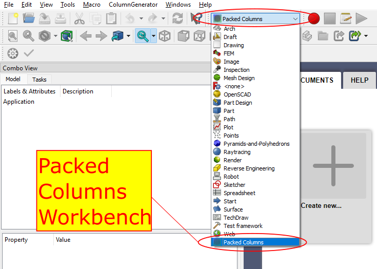
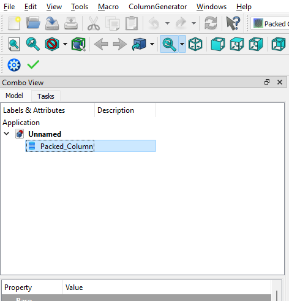
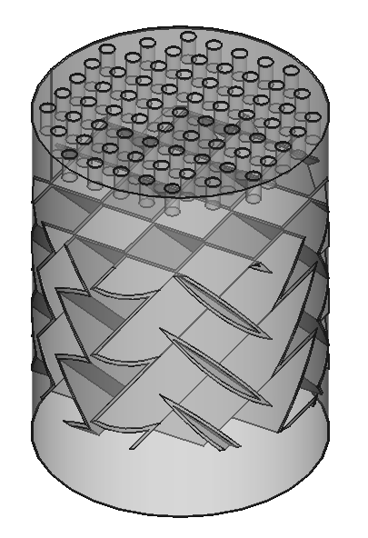
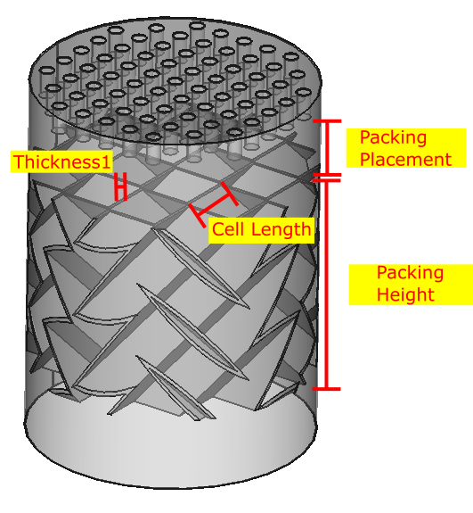

# User Guide

## Getting started

## Example 1: Default structured packing 

###  1. Create a new document `File` &rarr; `New` and select the `Packed Columns`	Workbench as shown below.

### 2. In the menu bar, select `ColumnGenerator` &rarr; `Packed Column` to create an instance of packed column.

### A `Packed_Column` object appears in the tree view.

### 3. Select the packed column instance and review the column parameters in the property editor. Make any changes if needed.

### 4. With the packed column selected, click on `ColumnGenerator` &rarr; `Generate` to generate the column.

### 5. This constructs the default column with default structured packing. For a detailed description of the column parameters refer to the `Parameter Description` section below.

## Example 2: Intensified structured packing

### 1. Repeat the steps 1-3 in Example 1. Select the `Enable Intensified Device` option as `true`. This populates two new parameters, `Cooling Channel Width` and `Thickness2` in the Property editor. Review these parameters and make modifications if needed.

### 2. With the packed column selected, click on `ColumnGenerator` &rarr; `Generate` to generate the column. 

### 3. This constructs the default column with the default intensified structured packing. 

## Parameter Description

### Column Dimensions

| Parameter                | Description                      |
| ---------------------    | -------------------------------- |
| Column Height            | Height of the column.            |
| Column Radius            | Inner radius of the column body. |
| Column Wall Thickness    | Thickness of the column wall.    |

### Dripping Points

### Packing Angles

### Packing Dimensions

## Authors
 > [Yash Girish Shah](mailto:yashgirish.shah@netl.doe.gov)   
 > [Grigorios Panagakos](mailto:gpanagak@andrew.cmu.edu)
